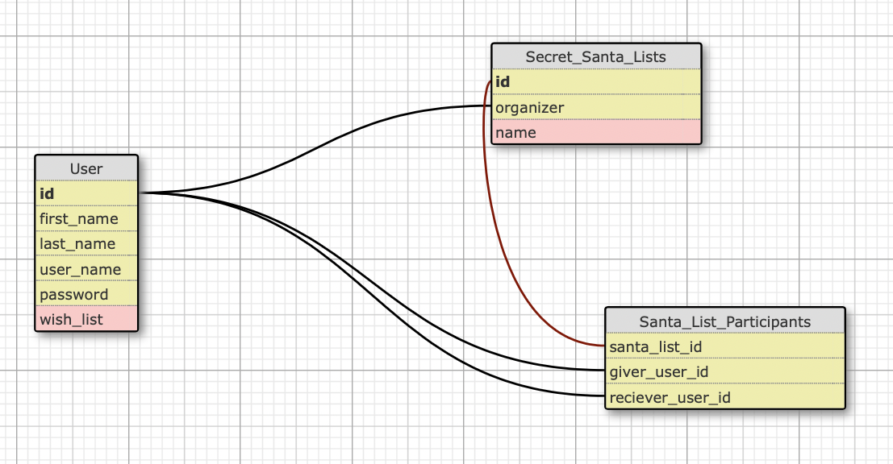

# Secret_Santa_App

Language: Ruby-on-Rails

Function: Secret Santa Generator

This app works as a Secret Santa Generator, which has the following features:

* User sign-in
* Add new list for Secret Santa participtants
* View who's paired together, and change matches if needed
* View who you need to buy a gift for from your generated lists
* View who you need to buy a gift for from other's lists
* Create your wishlist of gifts, which your Secret Santa can view
* Fun "Countdown to Christmas" tracker on your user dashboard

## Database
### Schema

## Pages
### Homepage

### Dashboard

### New List

### Generate/Mix List

